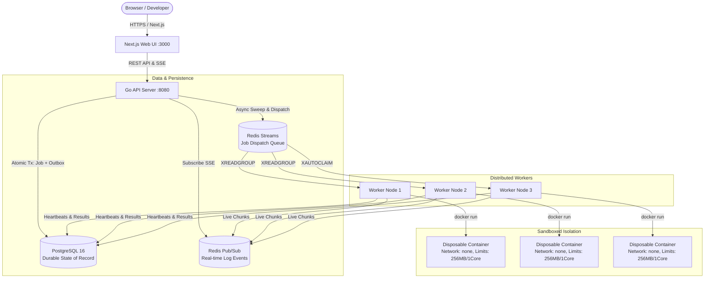

# ForgeQueue

<p align="center">
  <strong>Distributed Multi-Language Code Execution Platform</strong><br>
  Engineered with Go, Next.js, PostgreSQL, Redis Streams, and Ephemeral Container Sandboxes.
</p>

---

## Architecture Overview



---

## Key Engineering Highlights

1. **Guaranteed Durability (Transactional Outbox)**:
   - Jobs are written to PostgreSQL inside an atomic database transaction alongside an outbox event.
   - Background dispatchers and reconcilers push jobs into Redis Streams. If Redis or the API crashes, outbox sweepers ensure no jobs are permanently lost.
2. **True Consumer Groups & At-Least-Once Delivery**:
   - Workers leverage Redis Streams consumer groups (`XREADGROUP`, `XACK`, `XDEL`, `XAUTOCLAIM`).
   - Idempotent conditional database transitions ensure at-least-once delivery is processed safely without duplicate execution.
3. **Automated Crash Recovery & Janitor**:
   - Workers emit periodic heartbeats every 3s.
   - If a worker crashes mid-execution, background janitors detect the stale heartbeat, recover the orphaned job, and requeue it for retry up to 3 attempts.
   - Every execution attempt is immutably preserved in `job_attempts`.
4. **Selective Retry Engine**:
   - Infrastructure/worker crashes are retried automatically.
   - Deterministic user failures (syntax errors, compilation errors, runtime exceptions, timeouts) are marked terminal immediately and never retried.
5. **Practical Container Sandboxing**:
   - Ephemeral disposable containers with dropped capabilities (`--cap-drop ALL`), disabled network (`--network none`), no new privileges (`--security-opt no-new-privileges`), and hard resource caps (CPU: 1.0, RAM: 256MB, PIDs: 64).
   - Infinite stdout/stderr streams are bounded to 1MB using `BoundedWriter` to prevent memory exhaustion.
6. **Real-Time Streaming**:
   - Output chunks stream live via Server-Sent Events (SSE) and Redis Pub/Sub directly to Monaco-enabled web interfaces.
7. **Multi-Language Support**:
   - Python 3.12, JavaScript (Node.js 20), Go 1.22, C++ 17 (GCC 13), Java 21 (Temurin).

---

## Quickstart Guide

### 1. Prerequisites
- Docker & Docker Compose installed (or Go 1.22+ and Node.js 20+ for local host development).

### 2. Configure Environment
```bash
cp .env.example .env
```

### 3. Start Complete Stack
```bash
docker compose up --build
```

### Service Access URLs
| Service | URL | Default Credentials |
| :--- | :--- | :--- |
| **Web UI** | [http://localhost:3000](http://localhost:3000) | Register any username/password |
| **API Server** | [http://localhost:8080/api/v1](http://localhost:8080/api/v1) | JWT Bearer Token |
| **Grafana Dashboard** | [http://localhost:3001](http://localhost:3001) | `admin` / `admin` |
| **Prometheus Metrics**| [http://localhost:9090](http://localhost:9090) | None |

---

## Basic User Flow

1. Open [http://localhost:3000](http://localhost:3000).
2. Click **Register** and create an account (e.g. `dev_user` / `Password123!`).
3. Click **New Execution**, select **Python 3.12**, and submit:
   ```python
   print("Hello ForgeQueue")
   ```
4. Click **Run Code**.
5. Observe the live execution lifecycle:
   - `QUEUED` → `RUNNING` → `COMPLETED`
   - Output logs stream in real-time to the terminal console without manual page refreshes.

---

## Horizontal Worker Scaling

Scale workers horizontally with a single command:
```bash
docker compose up --scale worker=3 -d
```
Visit `/workers` in the Web UI to observe all active worker nodes, capacity slots, and real-time heartbeats.

---

## Running Automated Tests

Run the complete backend test suite:
```bash
# All unit, integration, and load tests
go test -v ./...

# Or with Makefile
make test
```

### Run Multi-Worker 100-Job Load Test
```bash
go test -v -run TestLoad_100ConcurrentJobsMultipleWorkers ./tests/load/...
```

### Run Worker Crash & Recovery Failure Demo
```bash
go test -v -run TestFailureDemo_WorkerCrashAndJobRecovery ./tests/failure_demo/...
```

---

## Troubleshooting Common Issues

1. **Port Conflicts**:
   If ports 5432, 6379, 8080, or 3000 are already in use on your host, adjust the corresponding ports in `.env` or `docker-compose.yml`.
2. **Database Connection Refused**:
   Docker Compose healthchecks ensure the API waits until PostgreSQL is ready via `pg_isready`. If running locally outside Docker, ensure PostgreSQL is running on `localhost:5432`.
3. **Docker Daemon Unavailable**:
   In environments where Docker daemon is unavailable, the worker automatically falls back to `ProcessExecutor` on the host, ensuring full testing and execution capabilities remain functional.

---

## License
MIT License. See [LICENSE](LICENSE) for details.
