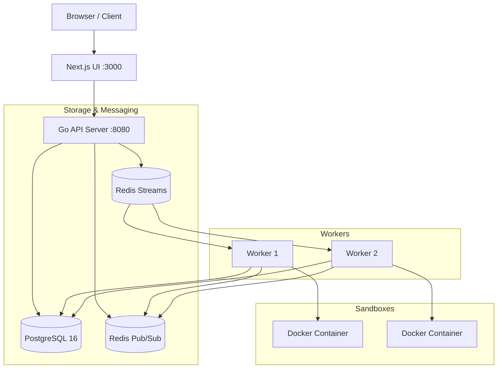

# >_ ForgeQueue

ForgeQueue is a distributed code execution engine built to run untrusted code safely across multiple languages. You submit code through a web UI or API, it gets queued, picked up by a worker, run inside a sandboxed Docker container, and the output streams back to your browser in real time.

I built this to learn how distributed systems actually handle the hard parts -- job recovery after crashes, exactly-once execution semantics, and running untrusted input without letting someone `rm -rf /` your server.

## Supported Languages

| Language | Runtime | Container Base |
|----------|---------|---------------|
| Python | 3.12 | `python:3.12-slim` |
| JavaScript | Node.js 20 | `node:20-slim` |
| Go | 1.22 | `golang:1.22-alpine` |
| C++ | C++17 / GCC 13 | `gcc:13` |
| Java | 21 (Temurin) | `eclipse-temurin:21-jdk` |

Adding a new language is just a config entry in `internal/runtime/runtime.go` -- you define the Docker image, the compile/run commands, filename, and timeout. No other code changes needed.

## Architecture



### How It Works

**Job submission and the transactional outbox**

When you submit code, the API writes two things in a single PostgreSQL transaction: the job record and an outbox event. A background goroutine polls the outbox table and pushes pending events to Redis Streams. This means if Redis goes down or the API crashes mid-request, the job is still safe in Postgres and will be dispatched once things recover. No submissions are ever lost.

**Queueing with Redis Streams consumer groups**

Workers pull jobs using `XREADGROUP` and acknowledge them with `XACK` when done. If a worker dies while holding a job, the other workers reclaim it using `XAUTOCLAIM` after a configurable timeout. All state transitions in PostgreSQL are idempotent, so even if a job gets delivered twice under at-least-once semantics, it won't run twice.

**Crash recovery and the janitor**

Every worker sends a heartbeat to PostgreSQL every 3 seconds. A background janitor process watches for stale heartbeats. If a worker disappears (OOM kill, network partition, segfault, whatever), the janitor detects it within ~15 seconds, marks that attempt as failed, and re-queues the job. Jobs get up to 3 attempts by default. Deterministic failures like syntax errors or compilation failures are marked terminal immediately and never retried -- there's no point re-running code that won't compile.

**Container sandboxing**

Each job runs inside a fresh ephemeral Docker container with these restrictions:
- `--network none` -- no internet access
- `--cap-drop ALL` -- no Linux capabilities
- `--security-opt no-new-privileges` -- can't escalate
- 1 CPU core, 256MB RAM, 64 PID limit
- 1MB max output (bounded writer kills the stream if exceeded)
- Configurable timeout (default 10 seconds)

When Docker isn't available (like during development), workers automatically fall back to running code directly on the host via `ProcessExecutor`. Obviously don't do this in production.

**Real-time streaming**

As code runs, the worker publishes stdout/stderr chunks to Redis Pub/Sub. The API server subscribes to the job's channel and forwards output to the browser over Server-Sent Events (SSE). You see output appear line by line as it's produced, not after the program finishes.

## Project Structure

```
cmd/
  api/              -- API server entrypoint
  worker/           -- Worker daemon entrypoint
internal/
  api/              -- HTTP handlers, middleware, router (chi)
  auth/             -- JWT tokens, Argon2id password hashing
  config/           -- Environment variable loading
  db/               -- PostgreSQL connection + migrations
  domain/           -- Core types (Job, Worker, Attempt, etc.)
  executor/         -- Docker and process-based code executors
  metrics/          -- Prometheus metrics collectors
  outbox/           -- Transactional outbox dispatcher
  queue/            -- Redis Streams + in-memory queue implementations
  recovery/         -- Janitor for crash recovery
  repository/       -- PostgreSQL + in-memory data access
  runtime/          -- Language runtime definitions
  statemachine/     -- Job status transition validation
  worker/           -- Worker loop, heartbeat, job execution
migrations/         -- SQL schema (embedded via go:embed)
web/                -- Next.js 14 frontend (App Router)
tests/
  failure_demo/     -- Worker crash + recovery integration test
  load/             -- 100-job concurrent load test
deployments/        -- Dockerfiles for api, worker, web
```

## Getting Started

### Prerequisites

- Docker and Docker Compose
- (Optional) Go 1.22+ and Node.js 20+ for local development without containers

### Setup

1. Copy the environment template:
   ```bash
   cp .env.example .env
   ```

2. Start everything:
   ```bash
   docker compose up --build
   ```
   First run pulls images and builds, takes a couple minutes.

3. Open http://localhost:3000, register an account, and submit some code.

### Services

| Service | URL | Notes |
|---------|-----|-------|
| Web UI | http://localhost:3000 | Next.js frontend |
| API | http://localhost:8080/api/v1 | REST API |
| Prometheus | http://localhost:9090 | Metrics |
| Grafana | http://localhost:3001 | Dashboards (`admin`/`admin`) |

### API Quick Reference

```bash
# Register
curl -X POST http://localhost:8080/api/v1/auth/register \
  -H "Content-Type: application/json" \
  -d '{"username":"dev","email":"dev@test.com","password":"password123"}'

# Login (returns JWT token)
curl -X POST http://localhost:8080/api/v1/auth/login \
  -H "Content-Type: application/json" \
  -d '{"username":"dev","password":"password123"}'

# Submit a job
curl -X POST http://localhost:8080/api/v1/jobs \
  -H "Authorization: Bearer <token>" \
  -H "Content-Type: application/json" \
  -d '{"language":"python","source_code":"print(\"hello world\")"}'

# Get job status
curl http://localhost:8080/api/v1/jobs/<job-id> \
  -H "Authorization: Bearer <token>"

# Stream job output (SSE)
curl http://localhost:8080/api/v1/jobs/<job-id>/events \
  -H "Authorization: Bearer <token>"
```

### Scaling Workers

Workers are stateless. Run as many as you want:

```bash
docker compose up --scale worker=3 -d
```

Each worker has a configurable concurrency (default 4 slots). Three workers with 4 slots each gives you 12 parallel job executions. The `/workers` page in the UI shows live capacity and heartbeat status.

## Running Tests

The test suite runs entirely in-memory (no Docker, Postgres, or Redis needed):

```bash
# Everything
make test

# Or directly
go test -v ./...

# Just the load test (100 concurrent jobs across 3 workers)
go test -v -run TestLoad_100ConcurrentJobsMultipleWorkers ./tests/load/...

# Crash recovery test (worker dies mid-job, janitor recovers it)
go test -v -run TestFailureDemo_WorkerCrashAndJobRecovery ./tests/failure_demo/...
```

There's also a k6 load test script in `tests/load/k6_load_test.js` for testing the live API under sustained load.

## Configuration

All configuration is through environment variables. See `.env.example` for the full list. Key ones:

| Variable | Default | What it does |
|----------|---------|-------------|
| `JWT_SECRET` | (required) | Signing key for auth tokens. Min 32 chars. |
| `WORKER_CONCURRENCY` | `4` | Max parallel jobs per worker |
| `WORKER_EXECUTOR` | `docker` | `docker` or `process` (fallback) |
| `JANITOR_STALE_THRESHOLD` | `15s` | How long before a missing heartbeat triggers recovery |
| `OUTBOX_POLL_INTERVAL` | `100ms` | How often the outbox dispatcher checks for pending events |

## Troubleshooting

**Port conflicts**: If 3000, 8080, 5432, or 6379 are taken, change the mappings in `docker-compose.yml` or your `.env` file.

**"Virtualization support not detected"**: Docker Desktop needs hardware virtualization (VT-x or AMD-V) enabled in your BIOS. Restart, enter BIOS setup (usually Del or F2), enable it under CPU settings, save and reboot.

**Database not ready**: The Docker Compose config uses `pg_isready` healthchecks, so services wait for Postgres. If running outside Docker, make sure PostgreSQL is up on `localhost:5432` before starting the API.

**Worker can't find Docker daemon**: That's fine for development. The worker logs a warning and falls back to `ProcessExecutor`, which runs code directly on the host without sandboxing. Don't use this in production.

**Frontend can't reach API**: Check that `NEXT_PUBLIC_API_URL` in your `.env` points to the right address. Default is `http://localhost:8080/api/v1`.

## License

MIT
