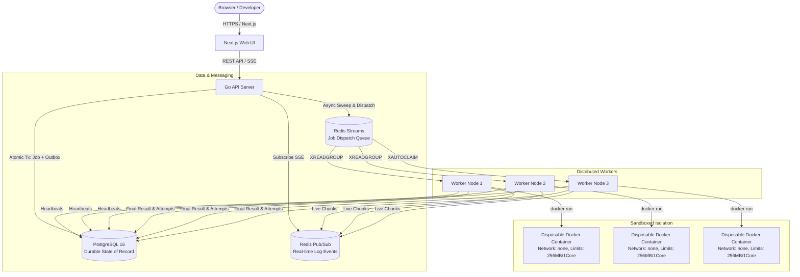

# ForgeQueue System Architecture

ForgeQueue is a production-grade, distributed code execution platform engineered for high reliability, durable state persistence, and resource-bounded container execution.

## Architectural Overview

## Core Subsystems

### 1. API Service (`cmd/api`)
- **Stateless HTTP Gateway**: Exposes `/api/v1` endpoints for authentication, job submission, status queries, and Server-Sent Events (SSE).
- **Transactional Outbox Dispatcher**: Asynchronous background goroutine that polls pending outbox events from PostgreSQL, publishes messages to Redis Streams (`forgequeue:jobs:stream`), and marks events published.
- **Outbox Reconciler**: Background sweeper that retries any events that failed publication during transient Redis network partitions.
- **Idempotency Engine**: Scopes `Idempotency-Key` headers per user to prevent duplicate jobs on client retries.

### 2. Message Bus & Coordination (Redis Streams & Pub/Sub)
- **Work Stream (`forgequeue:jobs:stream`)**: Stores dispatch messages. Workers consume via consumer group `forgequeue-workers`.
- **Consumer Group Semantics**: At-least-once delivery with message acknowledgment (`XACK`) and deletion (`XDEL`).
- **Real-Time Stream (`forgequeue:job:{id}:events`)**: Pub/Sub channel transmitting chunked stdout/stderr and status transitions to live SSE client connections.

### 3. Worker Service (`cmd/worker`)
- **Bounded Concurrency**: Semaphores limit active concurrent container processes per worker node.
- **Disposable Container Runner**: Executes arbitrary user code inside ephemeral containers with strict resource caps and no network access.
- **Heartbeat & Leasing**: Emits periodic heartbeats to PostgreSQL and Redis.
- **Stale Claimer**: Uses `XAUTOCLAIM` to take over orphaned messages from hung or crashed consumers.

### 4. Failure Recovery Janitor (`internal/recovery`)
- Detects stale worker heartbeats and transitions unresponsive workers to `OFFLINE`.
- Identifies orphaned running executions and requeues eligible jobs for retry with attempt increments, or transitions them to `FAILED` with `FailureCategoryInfrastructure` once max attempts are exhausted.
