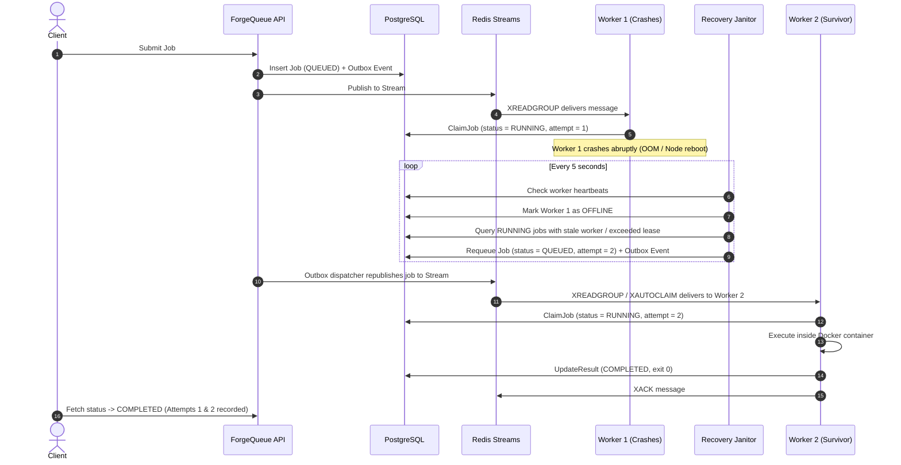

# Worker Failure Recovery & Re-claiming

One of ForgeQueue's flagship capabilities is resilient distributed failure recovery. If a worker node crashes mid-execution, jobs are never orphaned in `RUNNING` status.

## Recovery Sequence Diagram

## Selective Retry Strategy

ForgeQueue does **not** blindly retry all failures:

| Failure Type | Example | Eligible for Retry? | Outcome |
| :--- | :--- | :--- | :--- |
| **Worker Crash** | Worker host panics / network drops | **Yes** (up to 3 attempts) | Requeued to `QUEUED`, new attempt row |
| **Infrastructure Issue** | Docker daemon restart / disk full | **Yes** (up to 3 attempts) | Requeued to `QUEUED`, new attempt row |
| **User Syntax Error** | Python `SyntaxError: invalid syntax` | **No** | Terminal `FAILED`, exit 1 |
| **Compile Error** | C++ missing semicolon, Go build error | **No** | Terminal `FAILED`, exit 1 |
| **Runtime Exception** | Uncaught zero division, null pointer | **No** | Terminal `FAILED`, exit != 0 |
| **Execution Timeout** | Infinite loop (`while True: pass`) | **No** (unless configured) | Terminal `TIMEOUT`, exit 124 |
| **Retry Exhaustion** | 3 consecutive infrastructure failures | **No** | Terminal `FAILED` (`INFRASTRUCTURE_FAILURE`) |
