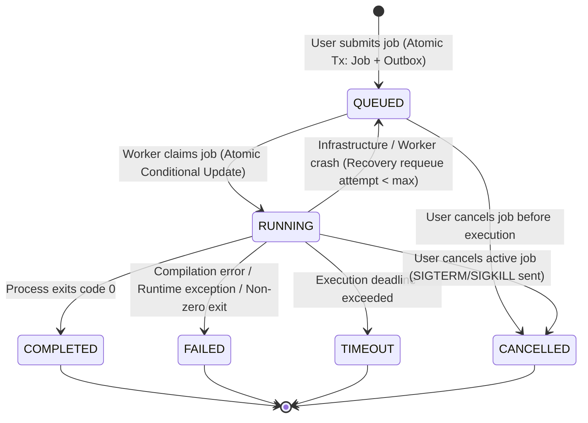

# ForgeQueue Job Lifecycle & State Machine

ForgeQueue enforces an explicit, centralized state machine governing all job lifecycle transitions. Random code paths are strictly prevented from arbitrarily mutating job state.

## State Transition Diagram



## Transition Rules & Invariants

1. **Terminal State Immutability**:
   Once a job reaches `COMPLETED`, `FAILED`, `TIMEOUT`, or `CANCELLED`, its state cannot be transitioned again.
2. **Atomic Conditional Updates**:
   A worker claims a job using:
   ```sql
   UPDATE jobs
   SET status = 'RUNNING', assigned_worker = $2, current_attempt = $3, started_at = NOW()
   WHERE id = $1 AND (status = 'QUEUED' OR (status = 'RUNNING' AND assigned_worker = $2))
   ```
   If another worker claimed the job or the user cancelled it while queued, zero rows are affected and the worker discards the message safely.
3. **Execution Attempt History**:
   Each execution attempt creates an immutable row in `job_attempts`. When a transient infrastructure failure causes a job to be retried:
   - The prior attempt record is preserved with its exit code, failure reason, and timestamps.
   - The job's `current_attempt` counter increments.
   - A new attempt row is created for the next execution.
   History is never deleted or overwritten.
